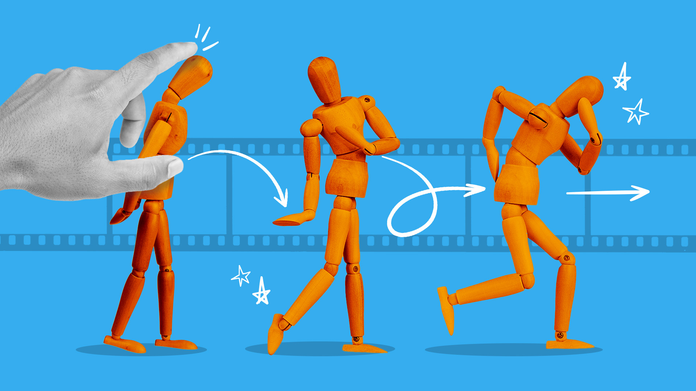

# StopMotionFilter (2D)

Make smooth 2D motion look like handmade stop motion. This repo extracts lower-body limb angles from a 2D video, fits a step-hold timing model with jitter and small rotation noise, writes a CSV with choppy angles, and optionally retimes the video to hold frames for a convincing stop-motion cadence.

> Status: v1 targets lower body only in 2D. Arms, torso and head are coming next.



## Features

- 2D pose to leg angles per frame using MediaPipe
- Fit or set your own stop-motion style
  - holds per second K
  - timing jitter sigma_t (seconds)
  - angle noise sigma_deg (degrees)
- Outputs a tidy CSV with `_chop`, `_vel`, `_acc`
- Optional video retime for visual preview
- One PowerShell cmdlet to run everything on Windows

## Demo

| Before | After |
|---|---|
| <video src="docs/media/test1.mp4" width="420" controls></video> | <video src="docs/media/video_choppy.mp4" width="420" controls></video> |


## How it works

1. `pose_to_angles.py` runs MediaPipe Pose on a 2D clip and writes per-frame leg angles:
   - `upperLeg`: thigh vs vertical
   - `lowerLeg`: knee flexion (hip–knee–ankle)
   - `ankle`: dorsiflexion (knee–ankle–toe)
2. `stopmotion_filter.py` fits or applies a step-hold model
   - choppy angles with plateaus and snaps
   - angular velocity and acceleration by finite differences
   - writes `angles_choppy.csv` and a `*_params.json`
3. `video_retime_hold.py` retimes the original video with frame holds and timing jitter
4. `pipeline_orchestrator.py` wires the steps together

## Requirements

- Python 3.9 or newer
- pip
- Windows, macOS, or Linux
- ffmpeg for trimming or contact sheets (optional but helpful)

Install Python deps:

```bash
pip install -r requirements.txt

